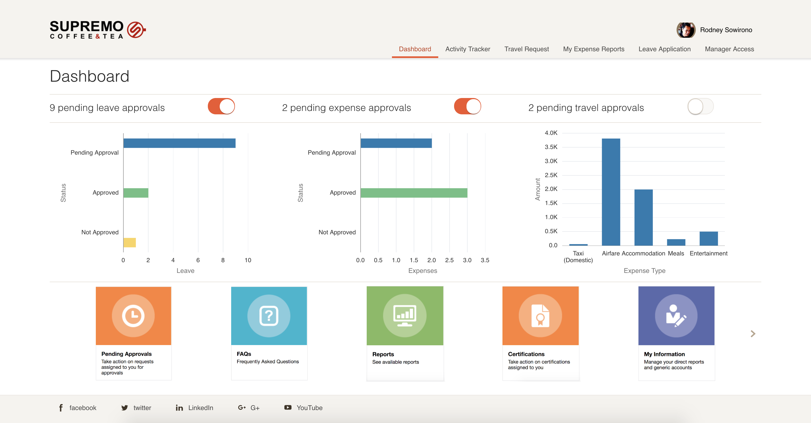
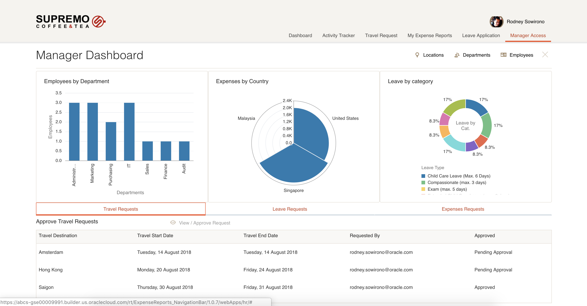
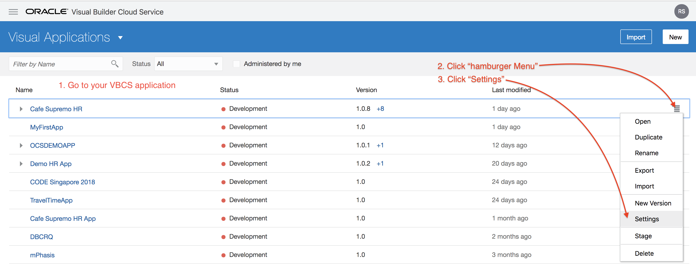
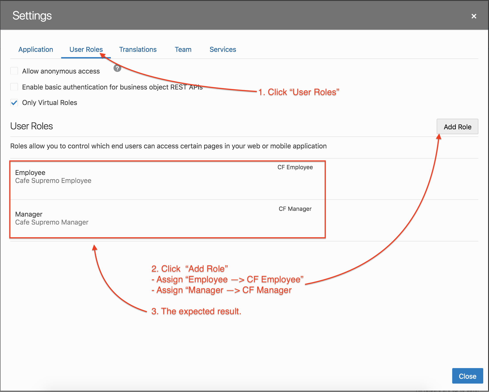
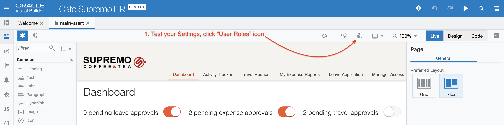
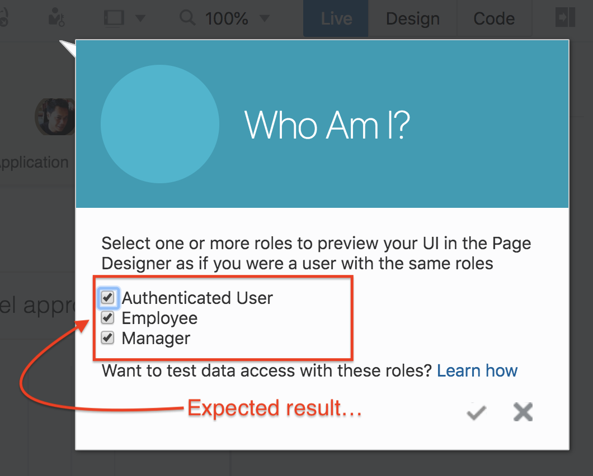

# Cafe Supremo Demo HR Application

## The Cafe Supremo HR Demo App
The following pictures shows a sample of the Demo Application.

 

## Demo Application Source
+ [Download Cafe Supremo Demo App Source Code](resources/materials/Cafe-Supremo-HR.zip)
+ [Cafe Supremo Story Board](resources/materials/Cafe-Supremo-VBCS-StoryBoard-Extension-v1.pdf)

## Post application import steps

> Assume you have imported the application source code above successfully.

### Roles Setup Instructions

Role based access control (RBAC) has been implemented in the demo. In order to provide access to the navigation within the application you will need to set up the following:

1. Create two new groups: CF Employee and CF Manager
2. Assign users that need access to the runtime app to the groups. For managers role, add user to CF Manager and CF Employee groups. For Employee role only add user to CF Employee group.
3. Link GROUPS (CF Employee and CF Manger) to virtual Roles in VBCS

4. Test your configuration

