# ORACLE Cloud Test Drive: Autonomous Visual Builder Cloud Service

## Setting up Developer Cloud for Visual Builder

### Introduction
Developer Cloud provides you a streamlined and automated development to delivery process with a unified integrated solution. 

**Plan and Manage**

- **Issue Tracking** -
Track and prioritize tasks, defects, and features
- **Team Management** -
Assign ownership and track team execution
- **Agile Dashboard** -
Manage and track development sprints

**Code**
- **Version Management** -
Manage code with hosted Git repositories
- **Code Review** -
Conduct peer code review and comment directly on code
- **Track Changes** -
Associate code transactions with issues

**Build and Deliver**
- **Continuous Integration** -
Automate build, test, and delivery with popular frameworks
- **Orchestration** -
Orchestrate and monitor scalable complex builds
- **Deployment Automation** -
Streamline deployment to Oracle Cloud Services or on-premise environments

**Team Collaboration**
+ **Activity Stream**
-Stay informed on project activities with a live feed
+ **Wiki**
-Share knowledge, documents, and information
+ **Web Dashboard**
-Access all your project information from anywhere

### 1. Create a project in Developer Cloud
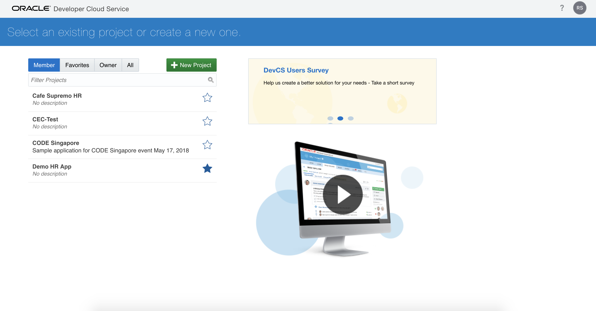
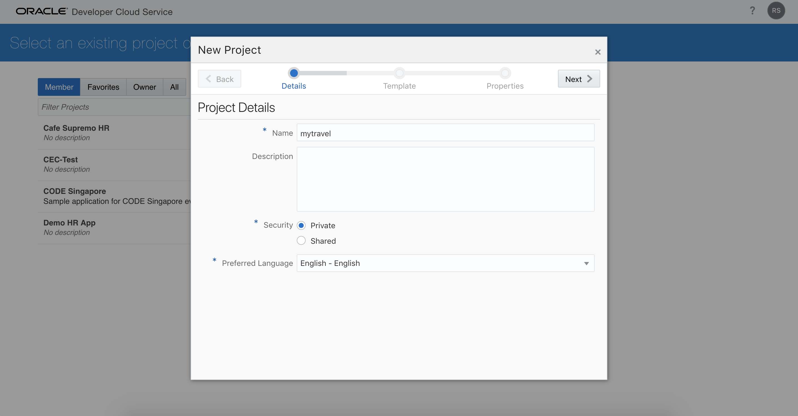
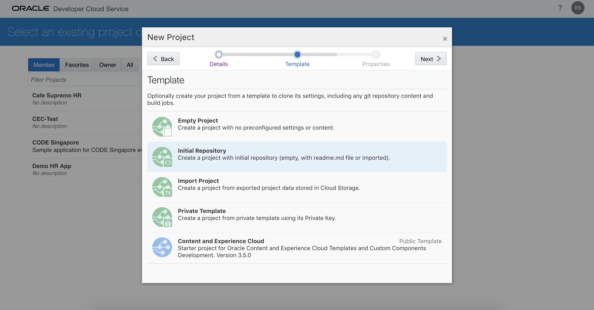
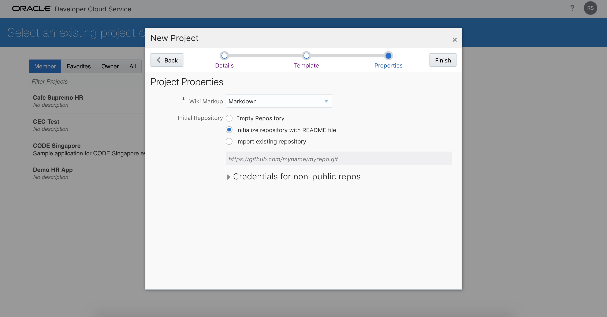
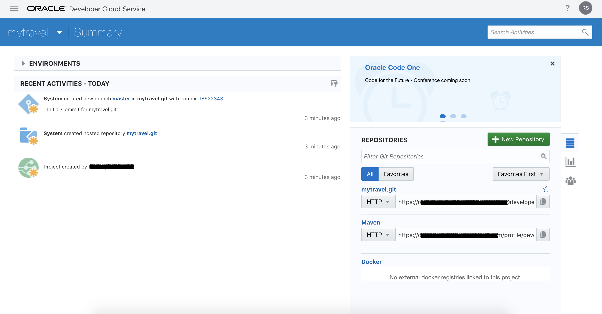

### 2. Link your Application to Developer Cloud
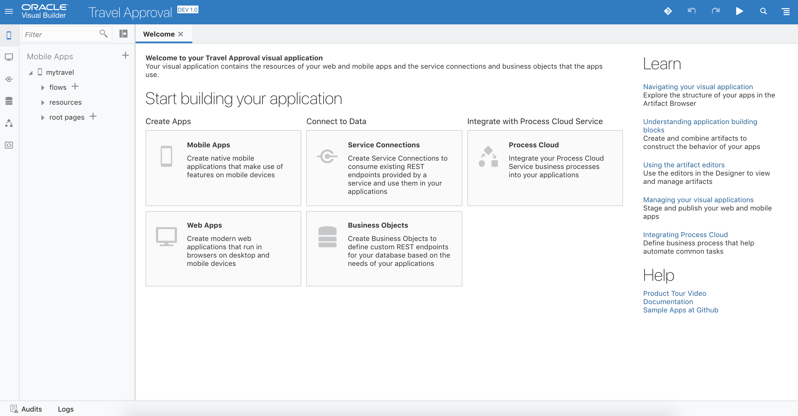
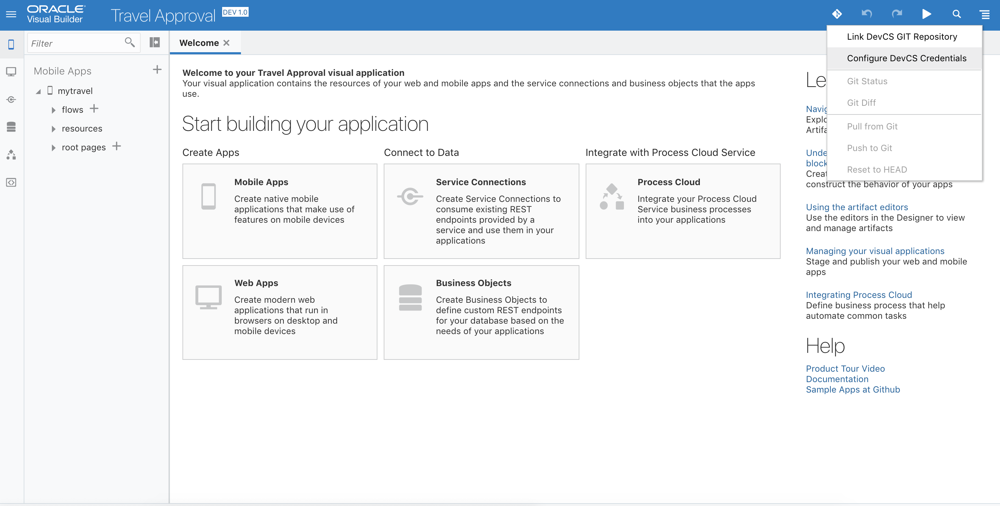
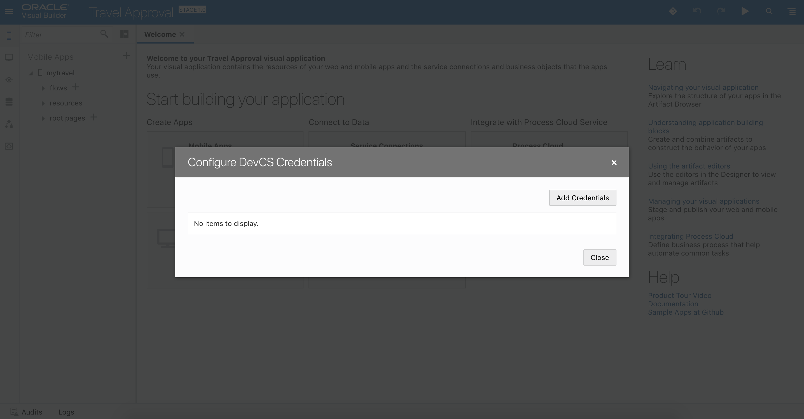
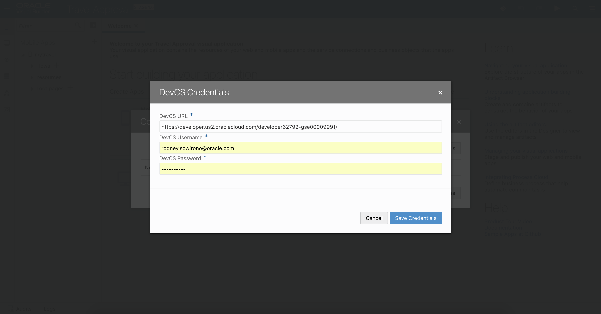
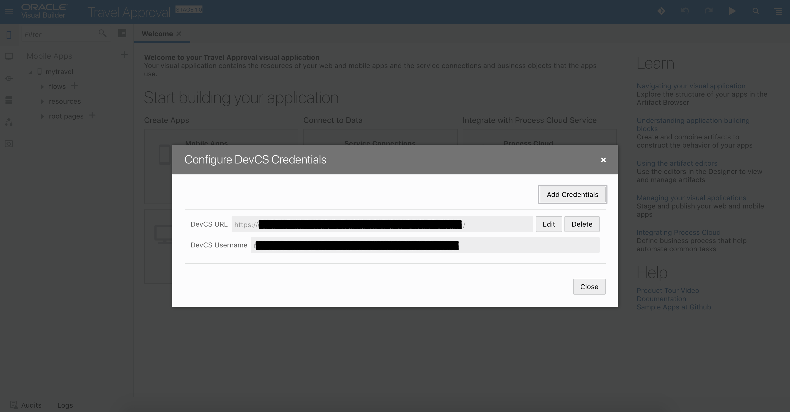
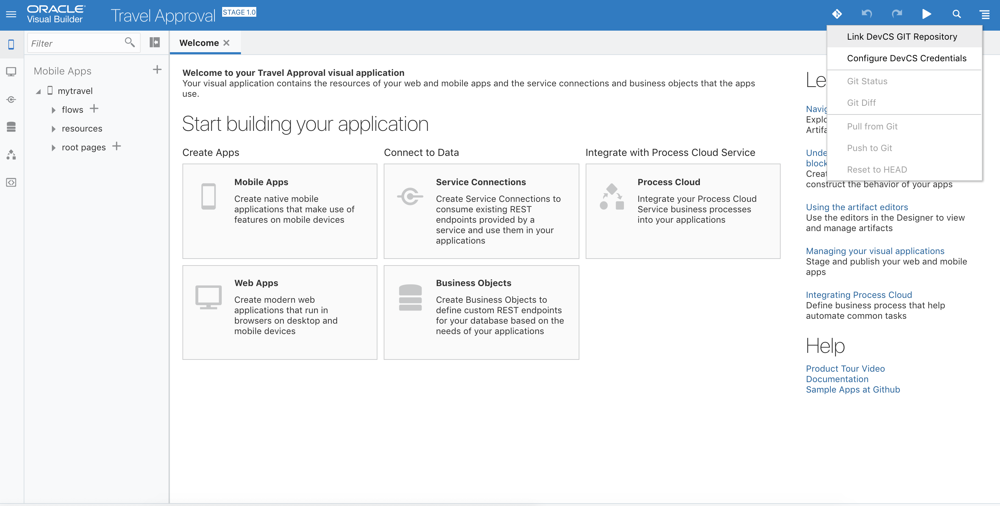
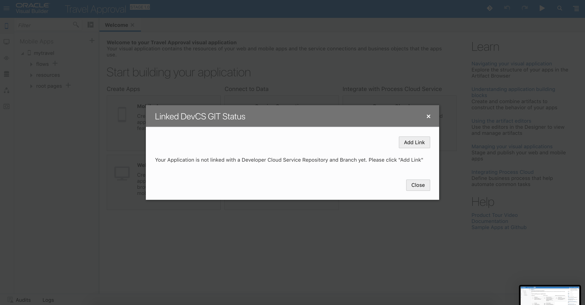

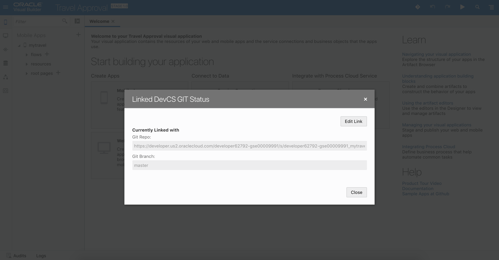

### 3. Push your build to Git repository in Developer Cloud
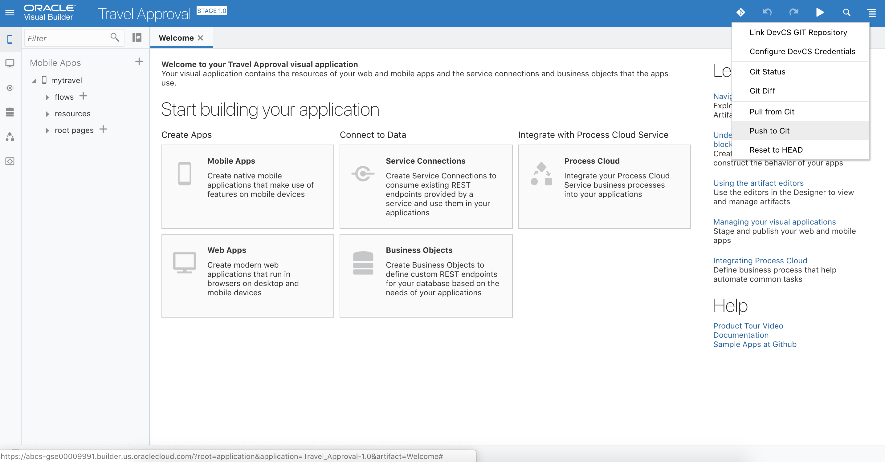
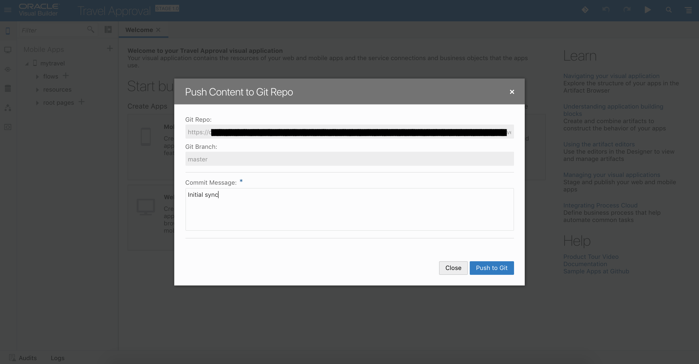
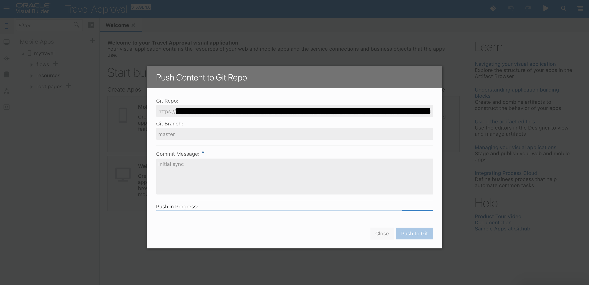

### 4. Verify the result in Developer Cloud
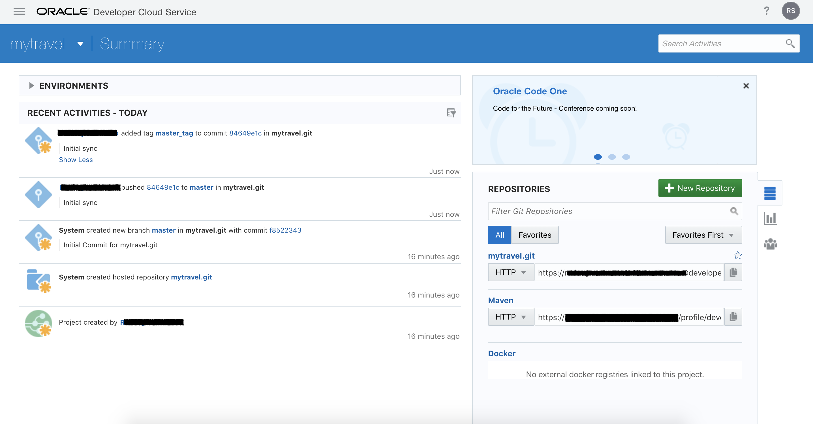
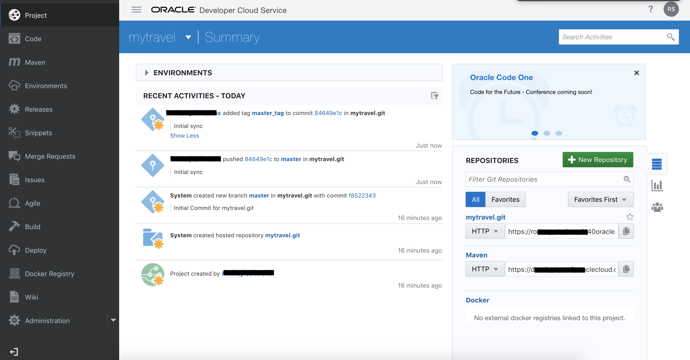
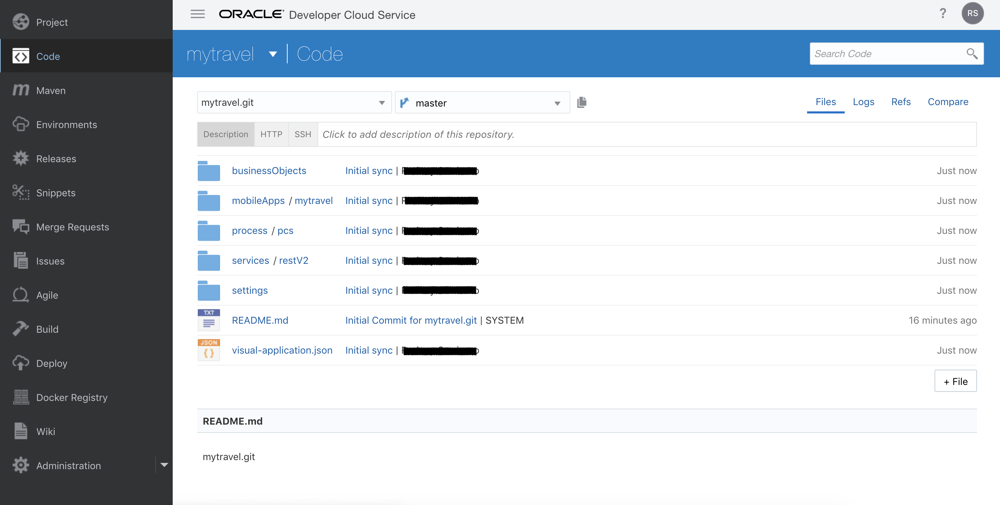

> [`HOME`](../README.md)
