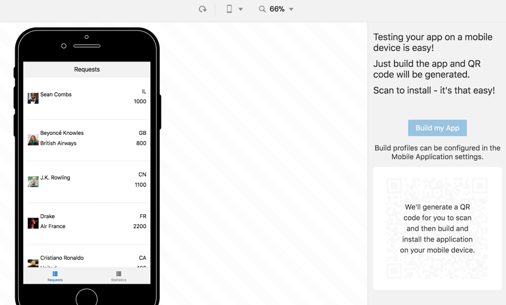
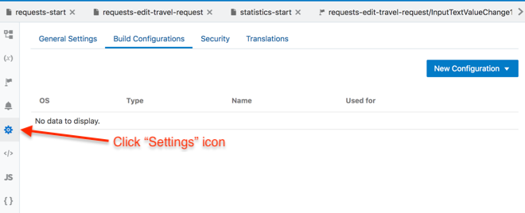
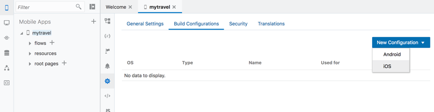
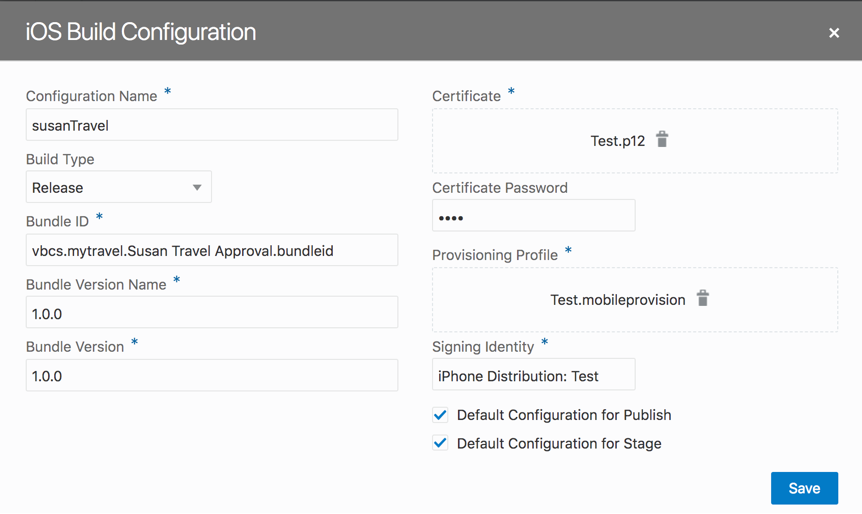
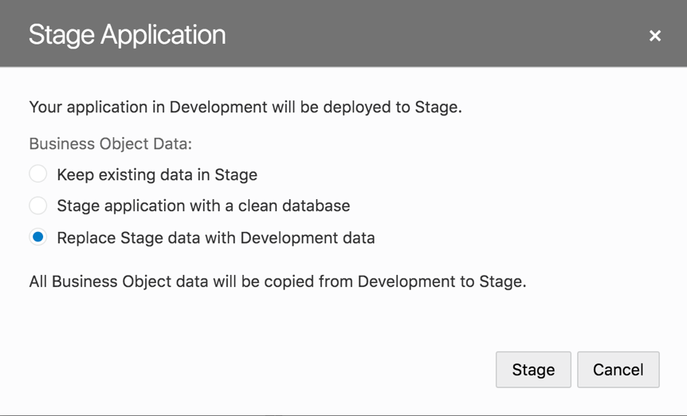
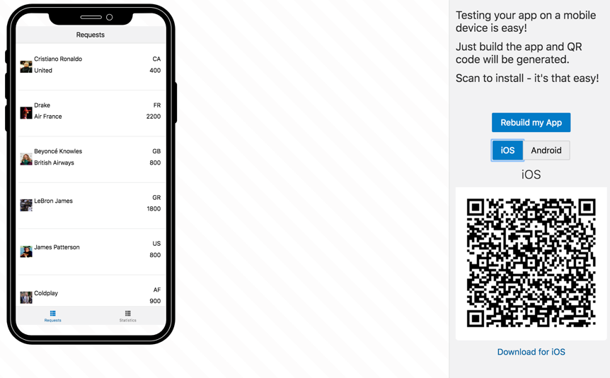

## 11. If You Have Extra Time

> In this lab you have run your app using the built-in mobile application simulator. You will have noticed that the **‘Build My App’** option was disabled

 

Before you can build the app for installation on an iOS or Android device, you have to create a Build Configuration

Below follows an example of how to setup and build an iOS version of your mobile app.  The lab does not provide the elements for you to complete this setup

Click on the **`Settings`** icon for your mobile app and click on the Build Configurations tab

 
Click **`New Configuration`**.

To follow this example, click on iOS, but if you are more familiar with Android, go there too

 

The configuration settings on the left side are defaulted by VBCS, but can all be edited to suit your needs

On the right side you must add your Apple Developer program credentials – whether an Enterprise or Standard program, developer of distribution profile etc.

> Note: it is outside the scope of this lab to provide instruction on how to get an Apple Developer Program account, go to developer.apple.com for more details

Add your provisioning profile, certificate and certificate password details to the configuration. Ensure that the Signing Identity is exactly as shown in your Keychain entry for the certificate. To ensure this, use Get Info in keychain and copy the complete entry from the Common Name property

If you want to use this profile as the default build when you ask VBCS to build your mobile app, click on the appropriate checkboxes (bottom right)

 

Now the Build My App button on your simulator running app will be enabled.

Clicking on it takes you to Stage Application. Here you can select how the business data should be deployed:

If this is a first Stage deployment you may want to take the development data into the app, or start with a clean database. For subsequent deployments you may want to keep any data that was in the previously staged version, start from clean or start from the development data again.

Once you hit the Stage button (above) the Mobile application is staged and, as it says on the screen, you can scan to install on your device (via the QR scan or by downloading the .ipa file) and start the next stage of your development process

## Congratulations you have completed your myTravel Mobile App using VBCS!

---
> [`HOME`](README.md) | [`PART 1`](MOB_PART_1.md) | [`PART 2`](MOB_PART_2.md) | [`EXTRA`](MOB_EXTRA_1.md)