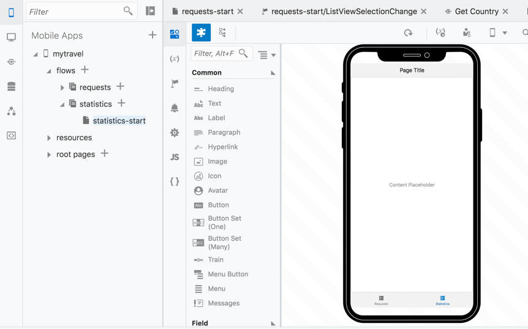
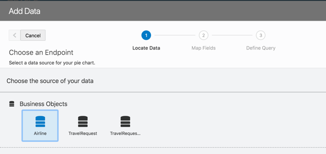
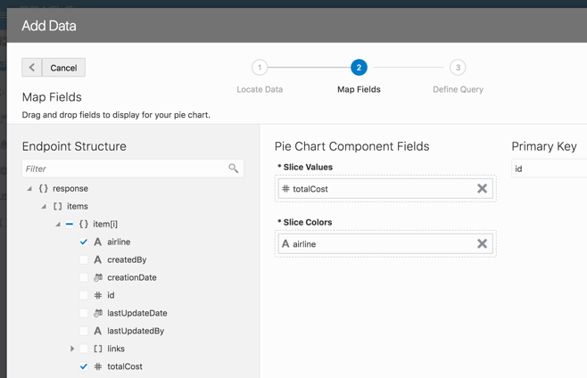
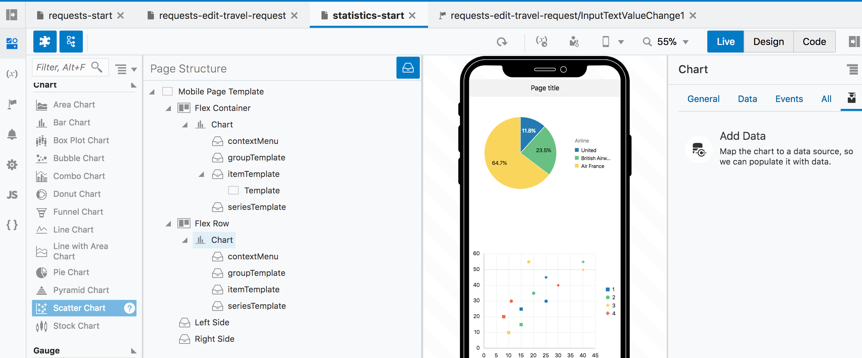
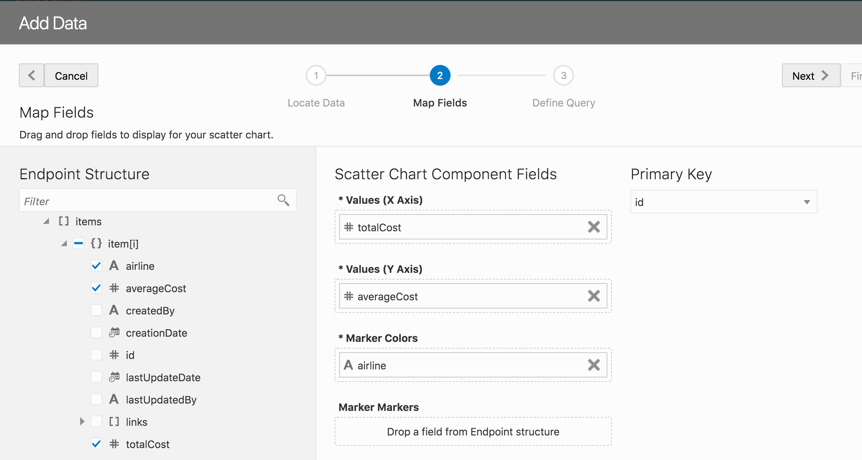
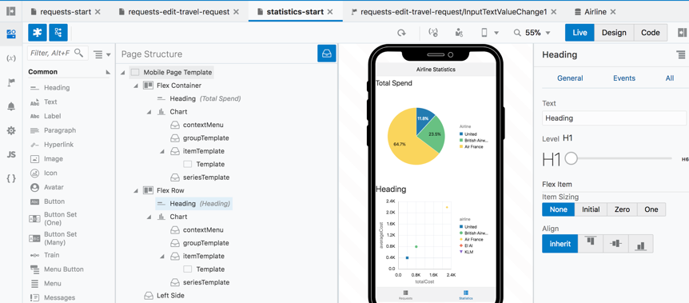
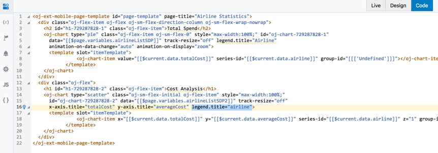

# 9. Create Visualizations of Data

*In this section you will add some visual components to the Statistics tab that you created at the start of this lab*

Expand the main **Application Navigator** and expand the mobile application **myTravel** that you are working on

Under flows are the **requests** flow you have been working on and the **statistics** flow – with a default page – click **`statistics-start`**** to open it in the **Visual Editor**

 

### Add Data Visualizations to a Page

Drag a **Pie Chart** from the **Component Navigator** onto the page

 

Click **Add Data**

Choose the **Airline Business Object** and click **Next**

 

Drag **totalCost** into the **Slice Values**

Drag **airline** into the **Slice Colors**

 

Click **Next**, **Finish**

Data from the Airline business object is immediately rendered on the chart

In the Property Palette for the chart, change the **animation-on-display** to **zoom**

With the **Flex Container** holding the Pie Chart selected, drag a **Scatter Chart** onto the Page (Hint: you may wish to use the Page Structure to insert the chart)

Select the **'Quick Start'** icon if not currently high-lighted.

Click **Add Data**

 

Select the **'Airline'** Business Object

Drag **totalCost** onto the **x Axis**

Drag **averageCost** onto the **y Axis**

Drag **airline** onto **Marker Colors**

Click **Next**, **Finish**

 

In the Properties for the **Page Template**, edit theA **Page Title** to read **Airline Statistics**

Drag a **Heading** item into each of the containers for the charts and name them:

**Pie Chart** – **Total Spend**

**Scatter Chart** – **Cost Analysis**

Experiment with the **Animate on Display** and **Animate on Data Change** properties of each chart
 

Click on the **Code** tab, see that you can edit all the elements in your page from here if you prefer – for instance, find the **legend.title="Airline"** for one of the charts and edit it to **legend.title="Airline Spend"**

 

## 10. Run The Application

Finally **Run** the application again in the mobile simulator and move between the pages, update data and review your animations. Click back to the Visual Builder and make changes to those properties and refresh the simulator browser tab to see the changes.

*This concludes the main hands on lab. Congratulations, you have created your first mobile application complete with Business Objects, a REST Service call and visualizations – all done in the Visual Builder Cloud Service primarily declaratively, but with access to the code if you prefer to work at the code level.*

### If you have extra time proceed to EXTRA

---
> [`HOME`](README.md) | [`PART 1`](MOB_PART_1.md) | [`PART 2`](MOB_PART_2.md) | [`EXTRA`](MOB_EXTRA_1.md) 
