# Building a ''*myTravel*'' Mobile App with Oracle Visual Builder Cloud Service

In this lab you’ll create an application that automates a process of approving travel requests that is currently done in spreadsheets. You will also call a public REST service and incorporate the results into your application.

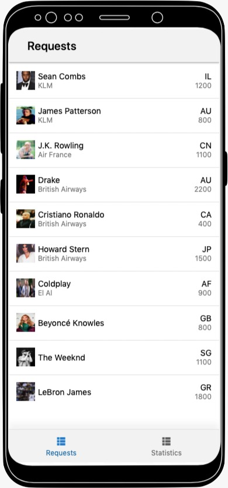  

----

## 1. Create a new Application

Click the **`New`** button

Provide a name for your application –  **`<YourName> Travel Approval`**
 
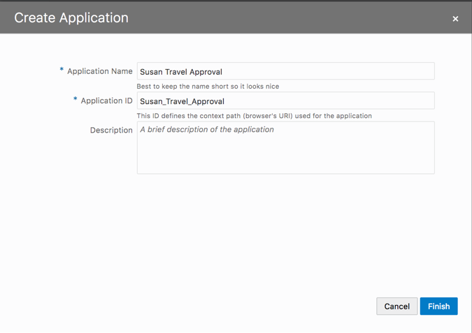 

Click **`Finish`** to complete the creation of your application.

> *You are now taken into the design environment where you’ll develop your application visually.*
> *From here you can create mobile or web applications, connect to external REST services (Service Connections), integrate with other processes (Process Cloud) or you can create your own Business Objects.*

## 2. Create Business Objects

> *You will create Business Objects to store data by importing an existing spreadsheet. You will then edit the Business Objects, adding fields and setting default values and creating a relationship between objects*

Click on the **`Business Objects`** icon to the left of the navigator 

> Note that the Business Objects navigator opens in the left panel

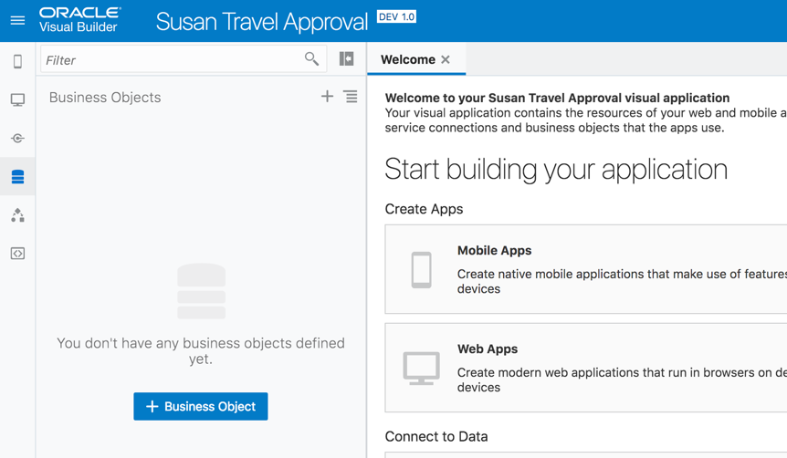  

At the top of the navigator, click the **`Business Objects`** menu and select Data Manager. This provides short cuts when creating business objects

 
 
Download the Business Object spreadsheet here: <a href="resources/materials/newFlights.xlsx">Dowload</a>. 

Once downloaded, Click on **`Import Business Objects`** to import data from a spreadsheet

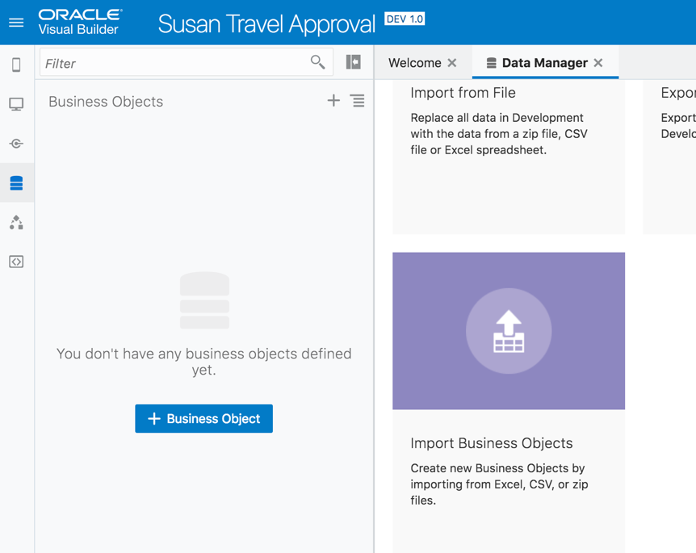  

Inside the Import Business Objects wizard upload the **newFlights** spreadsheet

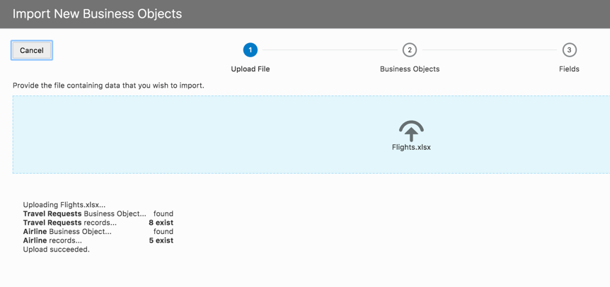  

Once you see the upload has succeeded click **`Next`**

Change the Name After Import and New Object ID from **TravelRequests** to **TravelRequest**

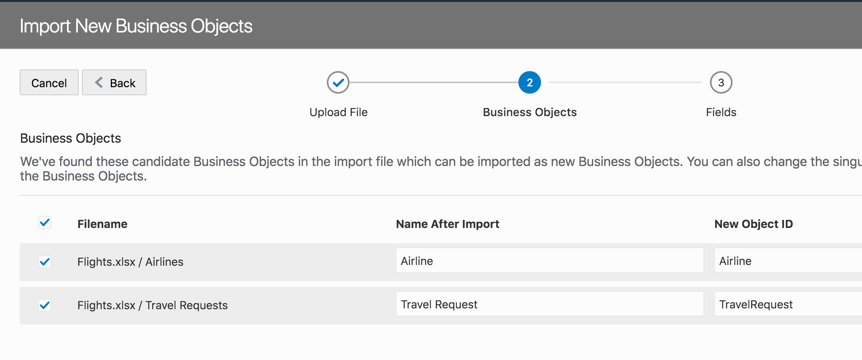  

Click **`Next`**

Click **`TravelRequest`** to see details of that Business Object

Change the **Type** of the field with the display label **Date** field from **DateTime** to **Date**

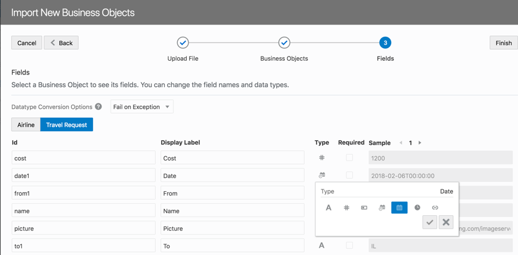  

Click **`Finish`** to complete the data import and **`Close`** to finish

> *Visual Builder creates the Business Object – it creates a table in the database, adds primary key (ID) and audit fields, imports the data from Excel into it and exposes a set of REST services that allow you to do the CRUD on that new business object*

Now you can edit the Business Object

In the **Business Object navigator**, click on **`Travel Request`** to open it in the editor

Click on the **`Fields`** tab

Click on **`+ New Field`** to add a new field to this business object

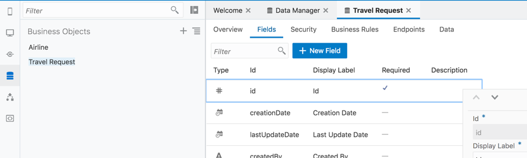 

Add a field called **Approved** of type **Boolean**

 

With the **Approved** field highlighted, scroll down the **Property Palette** to the **Value Calculation** section. Set the **Set to default if value not provided** of the **Approved** field to **false**

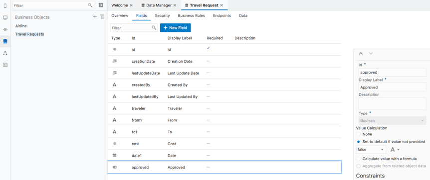 

Click on the **`Airline`** Business Object, select the **Fields** tab, note it has one imported field called **Airline** 

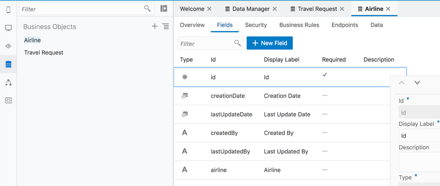
 
Click back on the **`Travel Request`** object

Add another field: **Airline** that is a **Reference** type field to the **Airline** Business Object. It automatically uses the ID field to accomplish this

Select the **Airline** field as the default display field

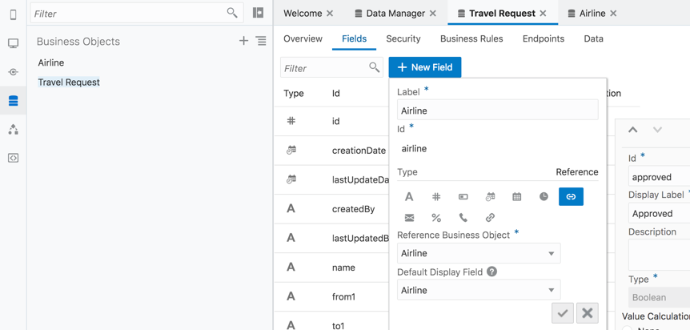 

Click on the **`Endpoints`** tab.

> Note the REST Endpoints that have been exposed to access the Business Objects in your apps

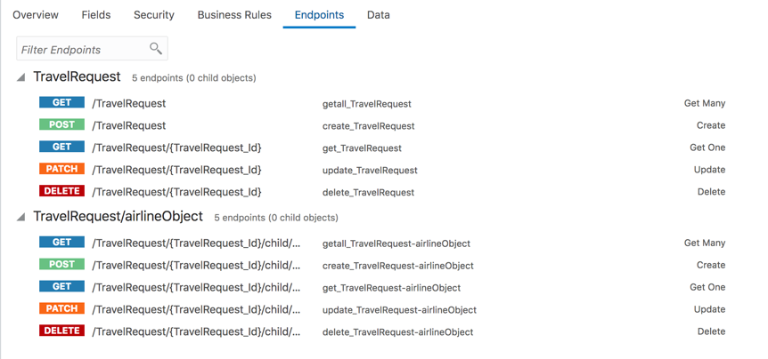 

Click back on the **Airline** object

Add a field: **Total Cost**, of type **Number** that is going to show the total cost of air travel expense requests by airline.

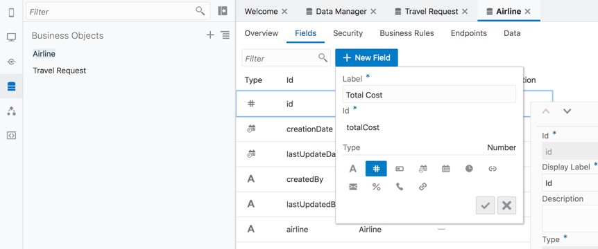 

With the **Total Cost** field selected, go to the Value Calculation section of the Property Palette and select **`(*) Aggregate from related object data`**.

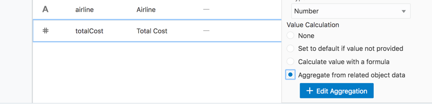 

Click the + **`Edit Aggregation`** button. See that the object to be aggregated has defaulted to **Travel Request, (using airline)**. 
Select **`Total`** as the function and select **`Cost`** as the field to be totaled. 

Click **`OK`**

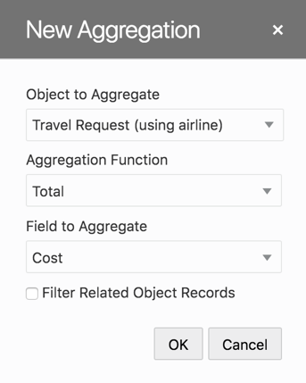

Add a field: Average Cost, type Number, that is going to show the total cost of air travel expense requests by airline

Again, with the Average Cost field selected, go to the Value Calculation section of the Property Palette and select **`(*) Aggregate from related object data`**

From the Travel Request object, select Average as the function and Cost as the field to aggregate

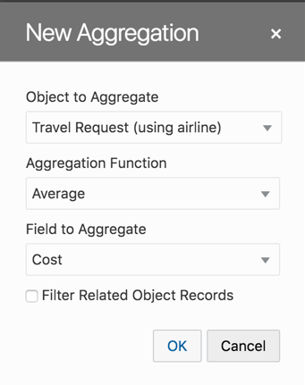 

## 3. Create the Mobile Application 

> In this section you will create a mobile app to enable the travel approval process, using the Business Objects you created earlier.

Click the **`Mobile Apps`** icon in the navigator and click the **`+ Mobile Application`** button (you can also close the open tabs in the editor)

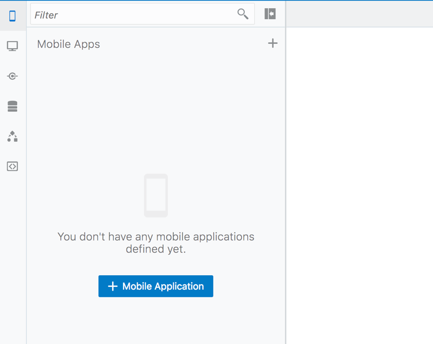 

Name the **Mobile Application** **`myTravel`**

Keep the default **Navigation Style (Bottom Bar)** and name two **Navigation Items**: **`Requests and Statistics`** , delete the third navigation item and click the **`>`** button

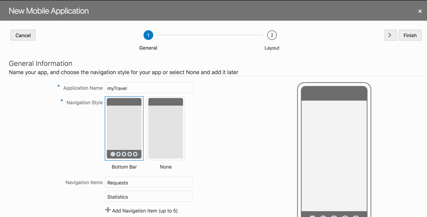

Now you can choose a default layout for your home screen. Select **No Content** then the **``Finish``**

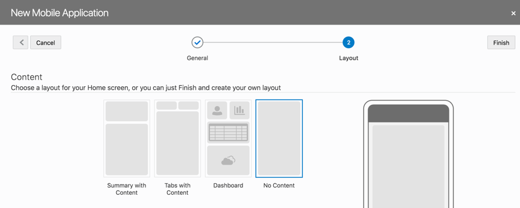 

Expand **`mytravel`** in the **Application Navigator**.

> *VBCS has created a page flow for each of the Navigation Items you specified earlier. It has also created a home screen for each flow and opened the first: requests-start. It is the entry point to your application*.

Collapse the **Application Navigator** and the **Page Structure** viewer (as necessary) by clicking on the collapse icons 

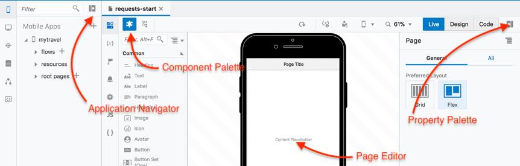
 

> *Now you are in the **Visual Page Editor**. On the left is the **Component Palette**, the main area is the **Page Editor** and to the right is the **Property Palette**.* 

If the **Property Palette** is not visible click on the **Expand** icon to the right of the **Code** button

> Note that you are in **Live** mode (we’ll come back to that later). Click and view your mobile app in different layout modes as you prefer

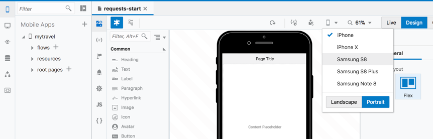
 
Ensure the **Design Tab** is selected. In the Editor, select **`Page Title`** and under Page Title in **Properties** name the page *"Requests"*

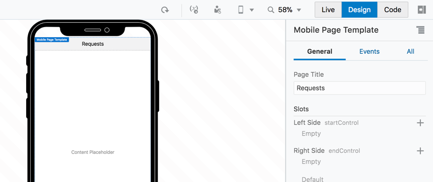 

From the Collection Section of the Component Palette drag a **List View** onto the page 

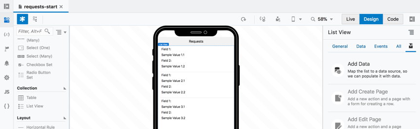 

## 4. Bind Data to the Screen

> *In this section you bind the elements on your screen to the data – in this case the **TravelRequest** Business Object. You access and update the data in the underlying table using the REST Endpoints that were created as part of the Business Object when you imported the spreadsheet*.

In the **Property Palette**, note the **Quick Start** tab (the educator icon) is open by default (or else click on the icon). From here you can quickly bind your list view to the data

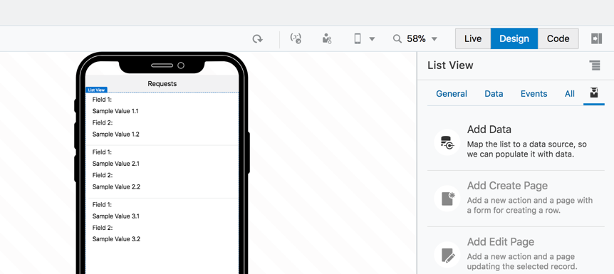 

Click on **`Add Data`**

Select the **TravelRequest** Business Object and Click **`Next`**

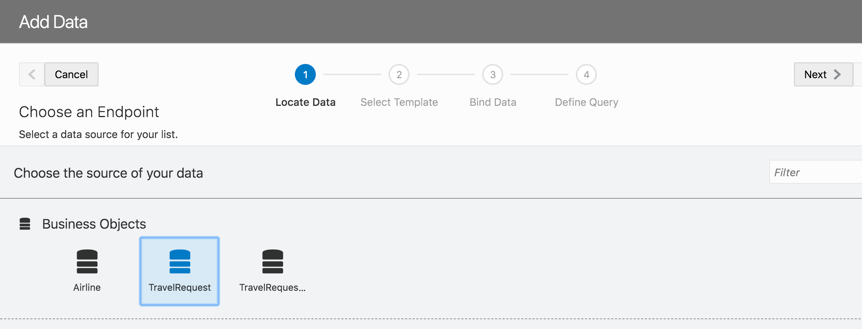

Now choose the **List Item** template and click **`Next`**

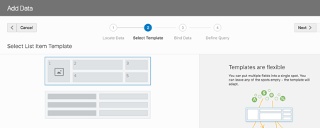

Drag and drop the **Fields** to be displayed on the page: **`Picture, Name, To, Cost and Airline`** into the corresponding Template Fields as shown in the image below

> Note that for Airline – you want to select the Airline from the referenced **Airline** object – by expanding the **AirlineObject** and the **Items** to use the text item Airline (as shown in the image below)

 

Click **`Next`** and then **`Finish`**

> Note that the Editor is now showing the live data from the Business Object, even in Design view

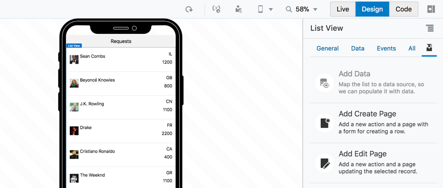 

### Add an Edit Page

Select the Quick Start **`Add Edit Page`** from the **Table Property Inspector**

Select the **TravelRequest** Business Object as the source data for this edit page and click **`Next`**

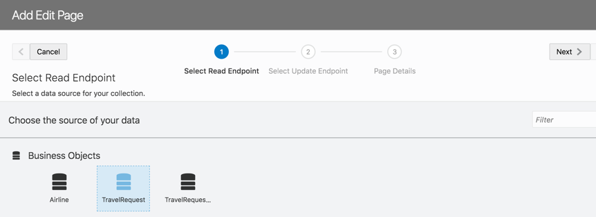

Do the same for the Update Endpoint – select the **TravelRequest** Business Object , click **`Next`**

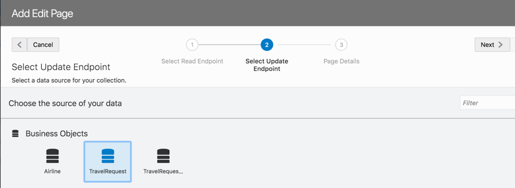

Select the fields to be displayed on the **Edit Page:** **`picture, name, approved, date1, cost, airline, to1`**. You can reorder the fields once you’ve selected them using drag and drop.
> Note that you select the airline reference field, not the airlineObject (that would give you the ID)
 
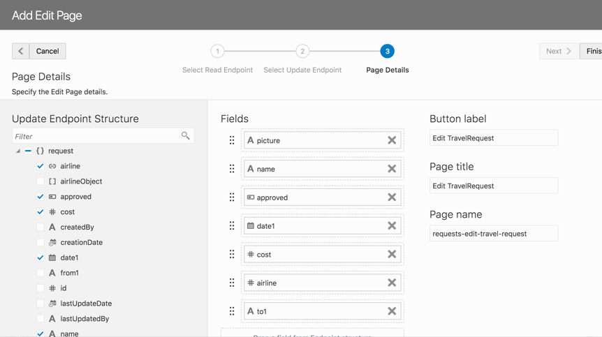

Click **`Finish`**

### Call the Edit Page from the Requests page

> *Now you set up the call from a record in the Requests page to open the Edit page for that request.*

Expand the **Page Structure**. Select the **List View** component  – or select it in the **Page Editor** directly 

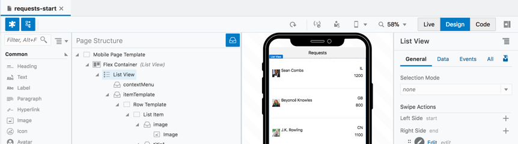 

On the General Properties for the List View – set the **`Selection Mode`** property to **Single**.

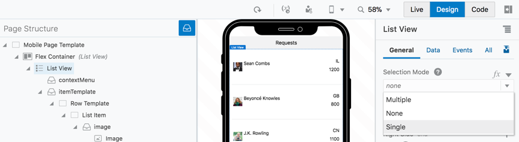 

### Create And Map An Event

> *Now you create an **Event** that fires each time a single record on the **`Request`** page is selected.*

Select the **`Events`** tab in the Property Inspector. Click **`New Event`** and select **`Quick Start: selection`**

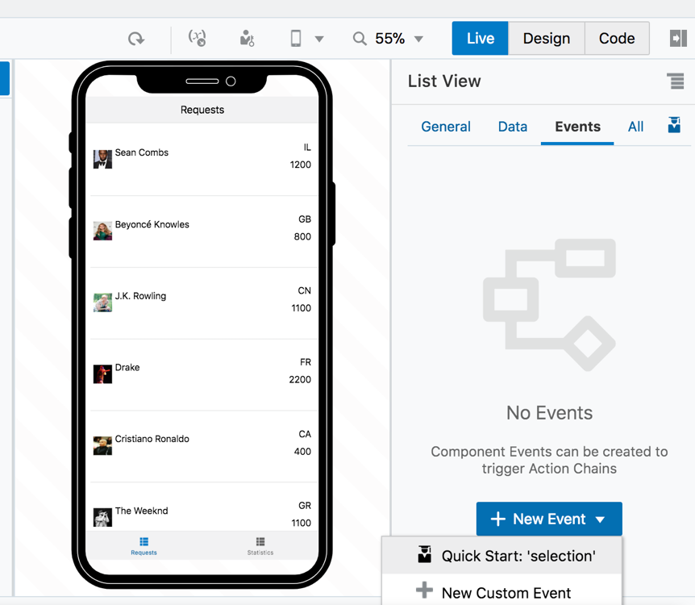  

> *Now you are in the Visual Action Flow Diagrammer – where you can map the exact event process that you want to happen when the user selects a row in the list.*

Drag a Navigate component onto the editor and click **'Select Target'** from the Property Inspector

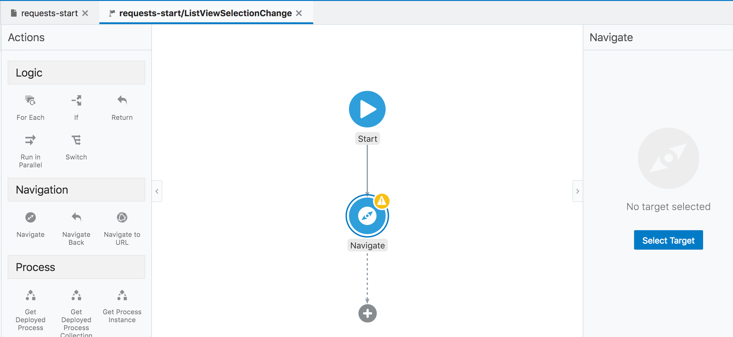 

Select Peer Pages to find the edit page you created earlier, and select **requests-edit-travel-request** (or similar if you renamed the edit page)

Click the **`Select`** button

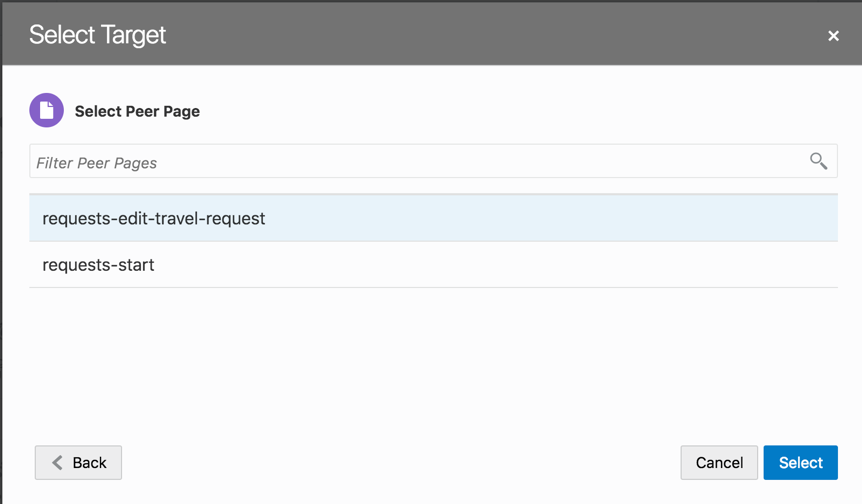 

Now click on the **Input Parameters : Assign** link in the **Property Inspector** to assign the selected row ID so its Edit page opens
 
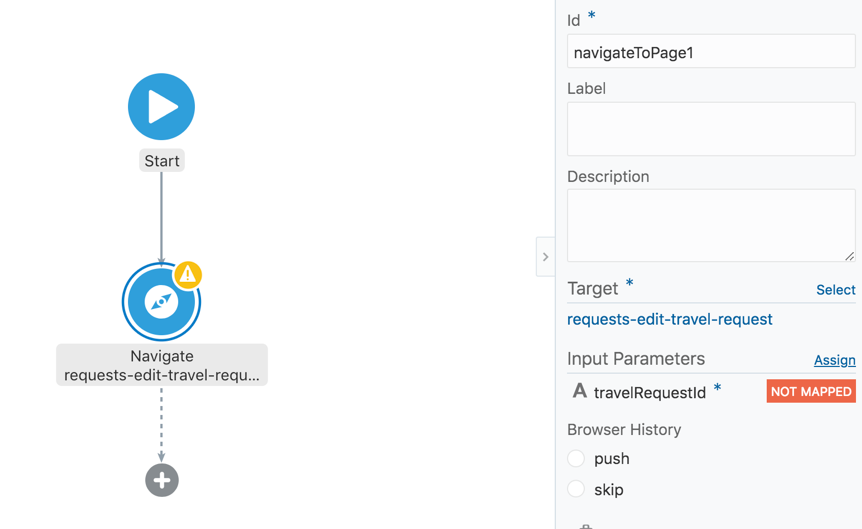

In the action mapper, under Sources, expand the Action Chain to find the **`Item`** that has been selected. Drag and drop to map that to the **travelRequestId**

Click **`Save`**

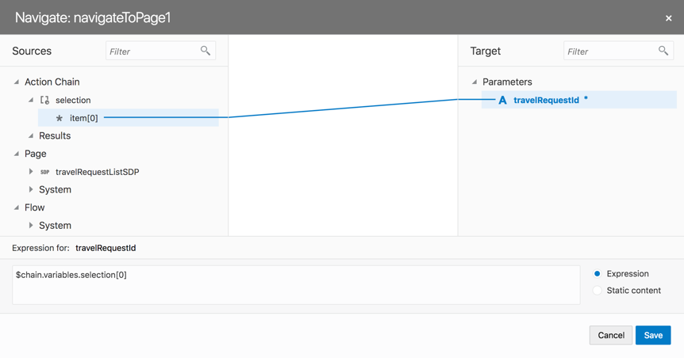 

> You have now created an action that fires when a row is selected – opening the detailed edit page for that row.

### Run The Application in a Simulator

> *Now you are ready to run the application*

Click the **`Run`** button in the top right menu icons of the window

  

Select a row and navigate to the Edit page – select an **Airline** and **Save**, repeat this for a number of requests and update fields as you wish

> *You are running the app in a simulator. There is a section at the end of this HOL that describes how to Build and Install the app on a device, if there is time*

View how the mobile app will render for different device types by selecting the mobile device type in the dropdown at the top of the window

## 5. Simulate Running the App in the Page Designer

*Running the application in the Page Designer allows you to access the live data while you are in design – so you can test not only the if the pages flow as you want them to, but also that the data and the relationships between the data are as you expect*

Return to your **Oracle Visual Builder Cloud Service** design-time via the browser tab 

Click on the **`requests-start`** tab 

Click on the **`Live`** button to move into Live mode

Select a record and the edit page opens with the live record selected

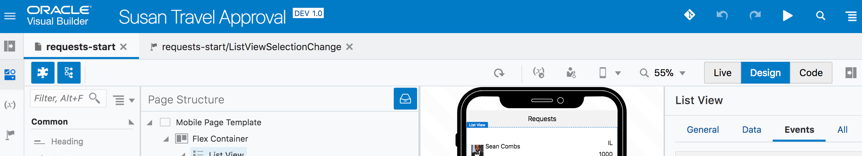  

Return to Design mode by clicking the **`Design`** button

## 6. Edit the Layout 

> *In this section you use the Page Editor and the Page Structure to work on the UI of the page*

In the Edit **TravelRequest** page, collapse the **Property Palette** and zoom the **Page Editor** canvas 

  

*In the **Page Structure** note that the first element in the page is a **`Flex Container`** that contains the default Form Layout and items you picked when you created the Edit Page*

From the **'Layout'** section of the **Component Palette** drag and drop a new top level **Flex Container** into the **Page Structure** – below the **Mobile Page Template**

> Note that it renames to **Flex Row**

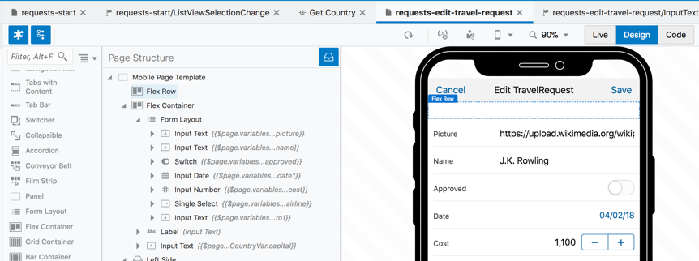  

Drag and drop 3 Flex Containers into the Flex Row (children of)  – using either the Page Structure or directly in the Editor. 

> Note – if you need to, use the Back arrow in the top right menu to retrace your steps

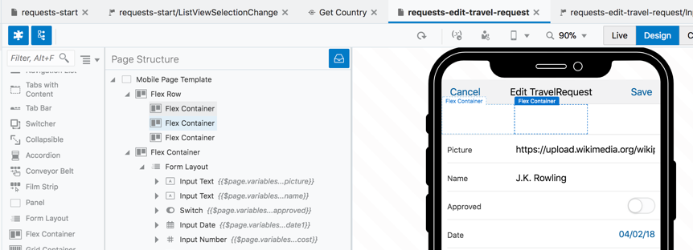  

From the **'Common'** section of the **Component Palette** drag and drop an **Avatar** into the first **Flex Container**

With the Avatar selected, expand the **Property Palette**, select the **`Data Tab`**

Now you are going to bind data to this avatar UI element 

Click the dropdown arrow above the **Src** box

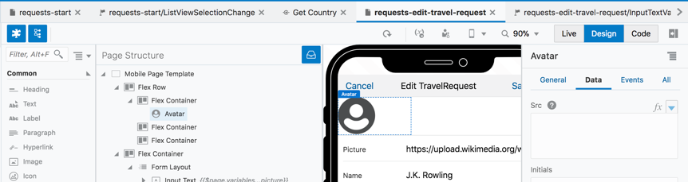  

The variables available for this page are presented to you. From the **travelRequestRecord** select **picture**. This is a URL to an image of the selected person record

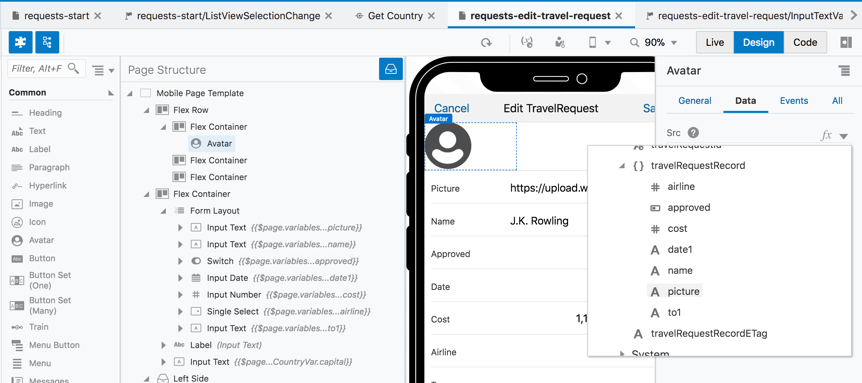  

In the **Page Editor** drag the **`Name`** below the Avatar. Note – the name field, not the label

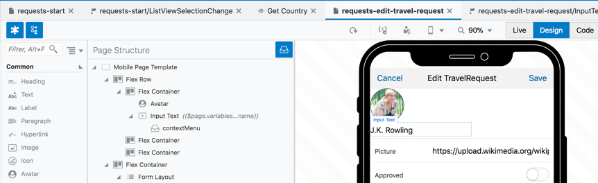  

Now select and delete the **Picture** URL to remove that default text field

Drag the **`Approved`** field into the right-hand **Flex Container** 

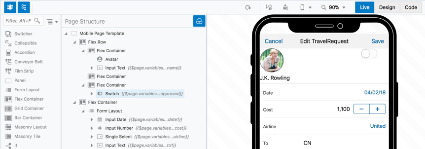  

In the **Page Structure**, note that by default, there is a **Flex Container** surrounding the **Form Layout**. Select that **Flex Container**

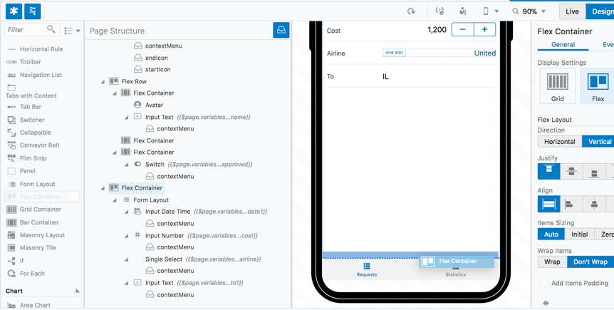  

From the **Component Palette** drag another **Flex Container** into the bottom of that existing Flex Container, as show in the image below. Alternatively, drag it directly into the Page Structure (you can re-order elements by dragging them within the Page Structure)

Whichever method you choose, the **Structure Pane** should look like this – one **Flex Container** that contains both the **Form Layout** and a new **Flex Container**

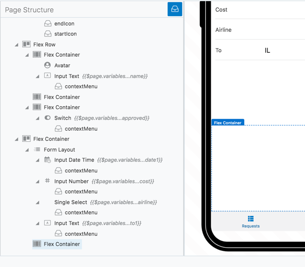 

With the new **Flex Container** selected, add an **Image** component into it from the **'Common'** section of the **'Component Palette'**

Now add a **Form Layout** below the **Image**, use the **Page Structure** directly to move components around

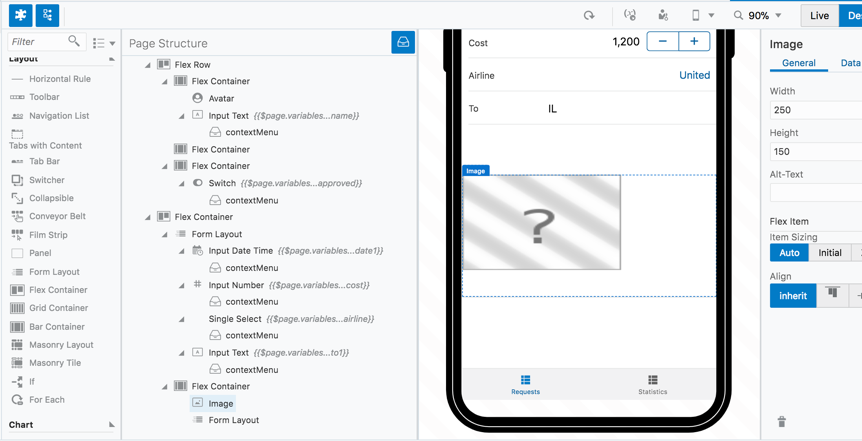
 

Select the **Image** and change the **Width** property to **250** and the **Height** property to **150**

Select the **Form Layout** and add 2 **Input Text** fields – label them **Country** and **Capital**. Add a Number Input field and label it **Population**. In the **Property Palette for each of these items, set them to **Readonly**

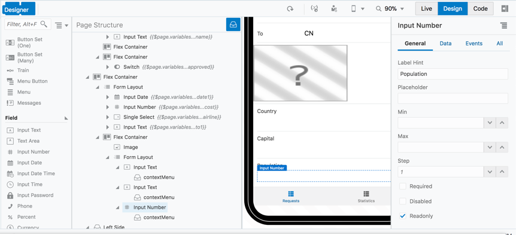 

> *In the next section you are going to populate these new fields from an external REST service*

## Call an External REST Service

> *Now you are going to call an external Rest Service from this page to provide some additional information about the country to be visited*

Expand the **Application Navigator** and open **Service Connections** 

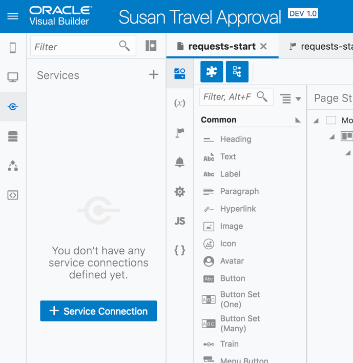 

Click on **+ Service Connection** to create a new connection

Click **Define by Endpoint**

In URL add https://restcountries.eu/rest/v2/alpha/{code}

In **Action Hint** select **Get One**

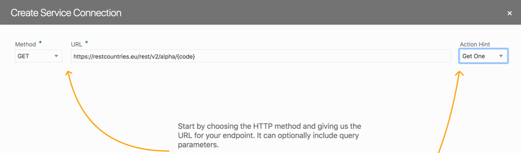 

*This is the REST service you will call. The service requires a parameter (country code) and it will return data about that country*

Click **`Next`**

Under the **Service** tab, name the service **GetCountry**

Under the **Test** tab, select **URL Parameters** and add a value of **US** 

Click **Send** to test the service and check that the correct country information is returned 

Try this again with different country codes such as UK, DE, FR, BR, JP

Click **Copy to Response Body**

Click **Response**, this shows the format of the response that you copied from the **Test** tab that will be returned by the **GetCountry** service

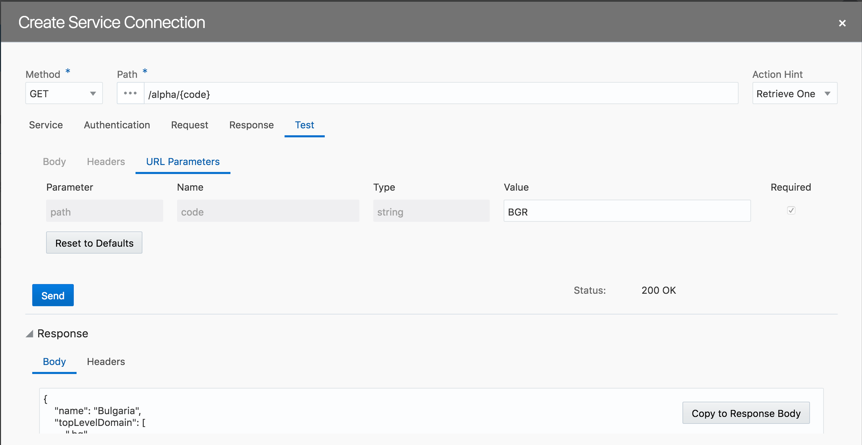 
 
Click **Create** to create the service. Visual Builder creates calls allowing you to call the service and access the data returned from within your application pages

### Create a Variable Based on the Service

> *In order to use the data returned in the REST Service call, you create a Type based on the format of the data returned. Then you create a variable based on that Type to use in your pages.*

Click on **`Variables`** icon of the Edit page, and select the **Types** tab

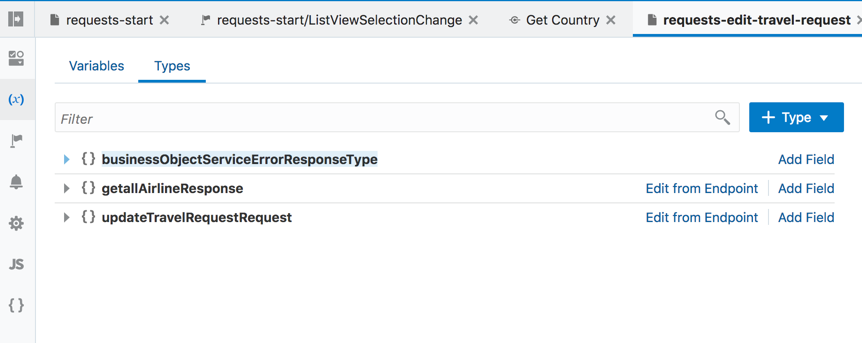 

Click on the **`+ Type`** dropdown and select From **Endpoint**

Expand **Service Connections**, **`GetCountry`** and select **`GET`**

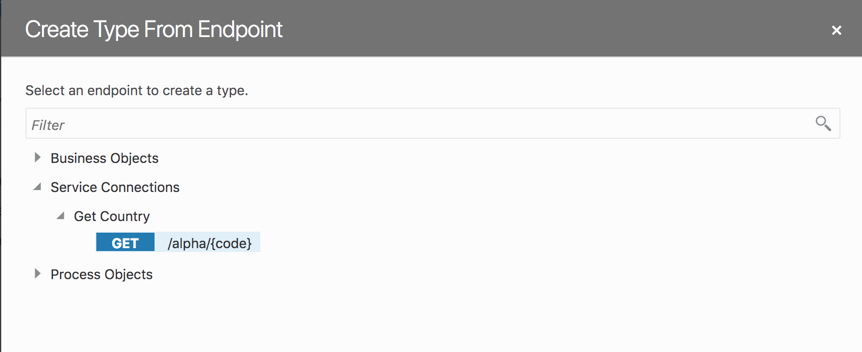 

Click **`Next`**

Call the **Type** **`CountryType`** and check the **Response**checkbox to select all the attributes returned by the service

Click **`Finish`**

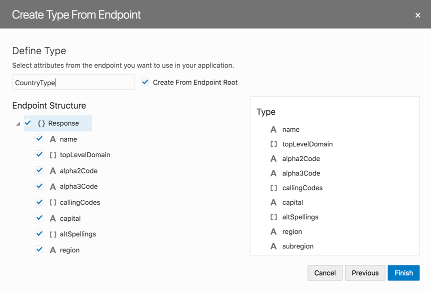 

Click on the **`Variables`** Tab to create a **Variable** based on the **CountryType**

Click **`+ Variable`**

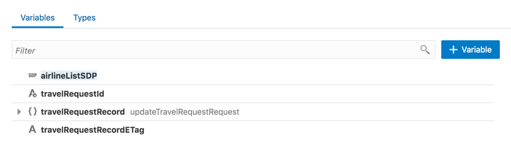 

Give the variable the ID **CountryVar** and select the **CountryType** as the type

Click **`Create`**

 

### Connect the Page Fields to the Variable

> *Now you are ready to connect the fields you’ve defined in your page with the variable you have created***

Return to the **Page Designer**

Select the **`Country`** field in the **Page Structure**

In the **Property Palette**, select the **Data** tab

Open the **Expression Editor** and select the **`name`** field from the **`CountryVar`** variable

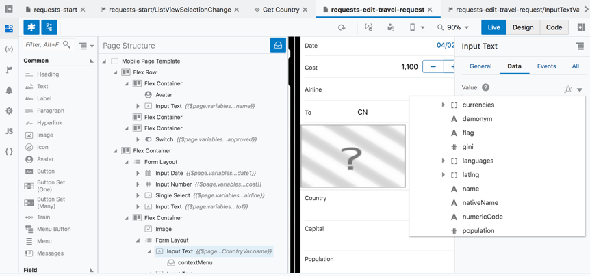 

Repeat for the Capital, Population and Flag fields

## 7. Use an Event to Call the REST Service from the Page

> *Finally you are ready to call the REST Service from the page – to do that, in this example, you will create an event that calls the REST service when the To field is selected*

Select the **`To`** field, in the Property Palette go to the **Events** tab

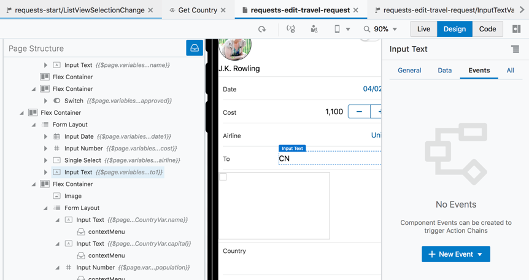

Click on the **New Event** dropdown and select **Quick Start: ‘value’**

Now you are in the **Actions Visual Flow Editor** 

From **Actions** palette, drag **Call Rest Endpoint** onto the ‘+’ as the first action 

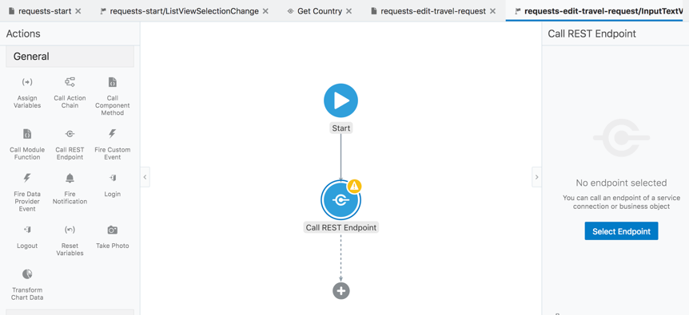  

Click **`Select Endpoint`** 

Expand **Service Connections** -  **GetCountry** and select **Get**

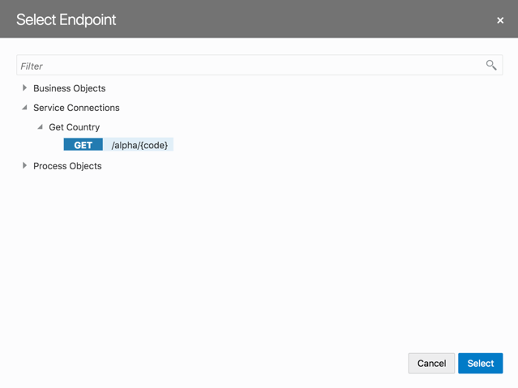 

Click **`Select`** 

In the **Property Palette** name the ID **CallCountryService**

### Map the Input Parameter 

*The REST service needs the country parameter to be passed to it. You define this by mapping the ‘To’ field in your page – the country code – to the REST service call*

Under **Input Parameter** click **`Assign`** 
 
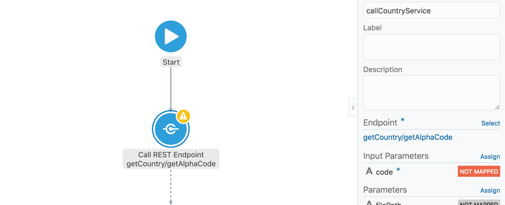

Under **Sources**, expand **Page – travelRequestRecord** and drag the **`to1`** value across to the **Target** **`code`** to map the page value to the required parameter in the Service

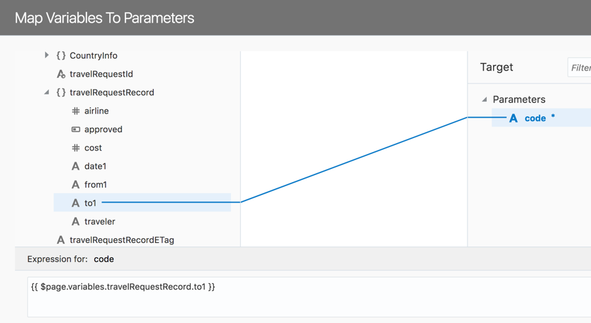 

Click **`Save`**

### Assign Return to Page Variable

> *Now you map the data returned by the call to the REST Service to the variable based on the response data format*

Drag and drop an **`Assign Variable`** action as the next step in the flow

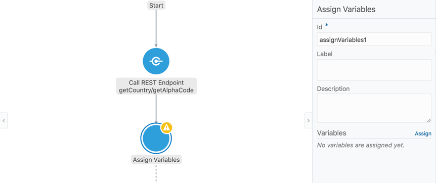
 

In the **Property Palette**, click **`Assign`** link 

Drag and drop from **Results – CallCountryService – body** to **Page – CountryVar** to map the service return into the page variable

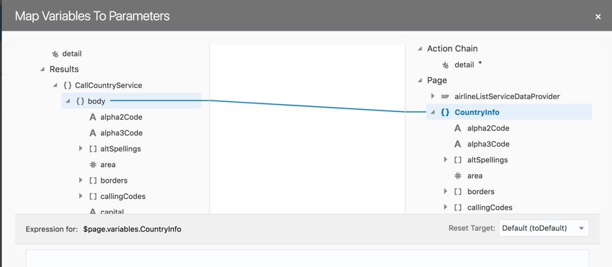 

Click **`Save`** to return to the Page Editor

### You’ve finished!

> *You’ve set up the call to the GetCountry REST Service that you defined earlier using the To field in the page. You passed the field to that service as a parameter. You’ve created a Variable of a Type based on the data format that is returned by the service.  You populated the variable with the returned data, you mapped the variable values to the fields on the page*

## 8. Run the Completed Application

Click **`Run`** to run the application

Select a row and click to open the **`Edit TravelRequest`** page

Change the destination to another country (ISO code) and ensure that the country field and data update

### Proceed to PART 2 of this HOL

---
> [`HOME`](README.md) | [`PART 1`](MOB_PART_1.md) | [`PART 2`](MOB_PART_2.md) | [`EXTRA`](MOB_EXTRA_1.md)
