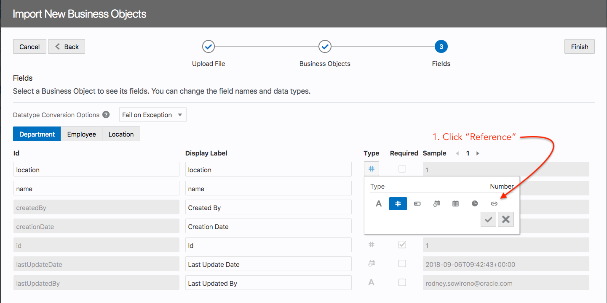
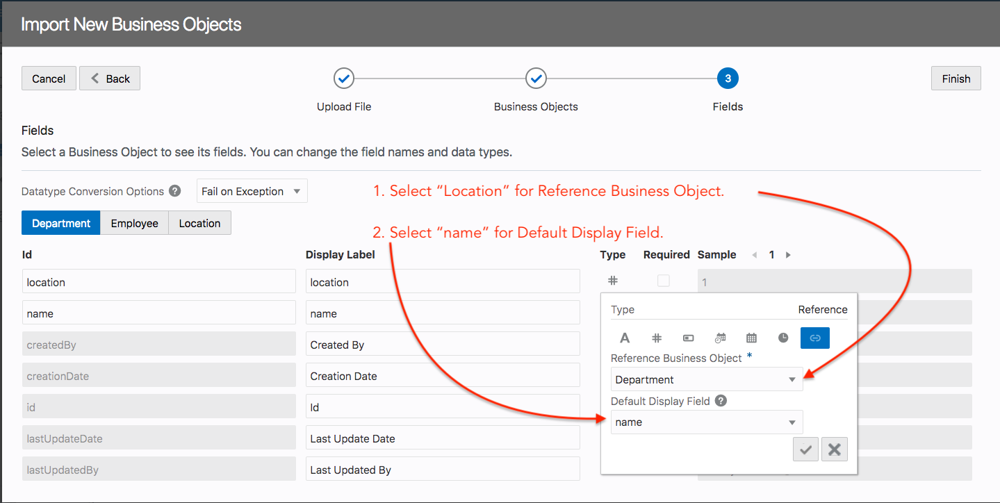
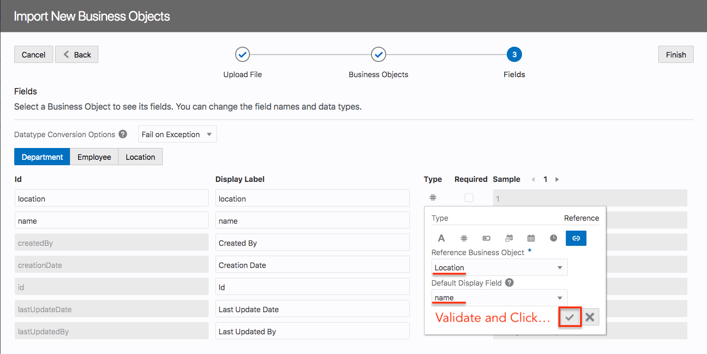
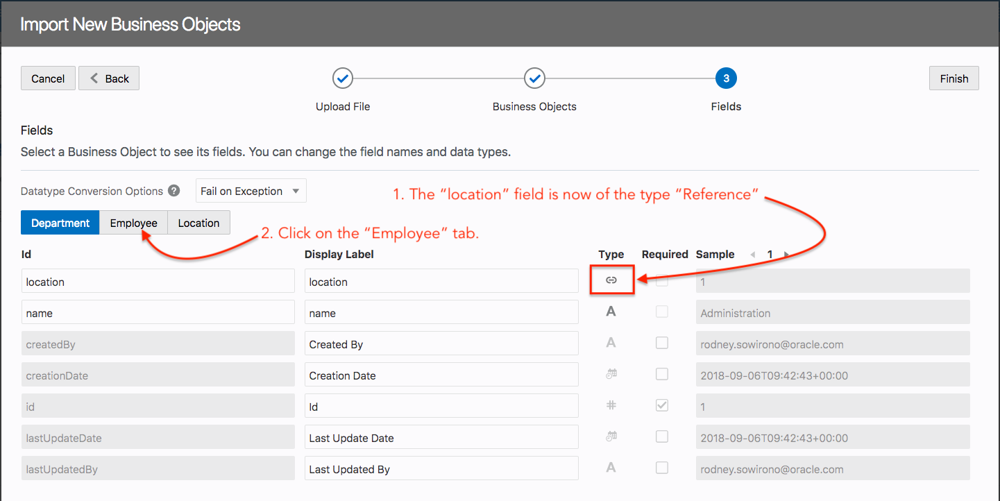

# Part 1: Creating your Business Objects (Data Model)
After this excercise you will have the following Business Object Model.

----
## Steps:
1. You will need to login into VBCS with your username and password

2. Create you first application

3. Fill in the mandatory fields, click `Finish`.

4. After your VBCS workspace opened, navigate to and click on the `Web Applications` icon on the left menu bar. This will open the Web Application section of VBCS. Now you can click on the `+Web Application` button; 

5. You are now asked to provide an `Id` for your web application. Fill in `HR-App` as the Id and click the `Create` button to continue.

6. Your application pallete will open and is ready for you to start building your application.
> Under the hr-app tree you can find the application flows, resources and root pages. Also note that the default application name is `main-start`. This is the starting page of your app.

7. The next images shows the details of the Business Objects you are going to create including the data. 

> You can create Business Objects in various ways either by creating it ussing the VBCS interface, where you manually specify the Business Object name and fields or import one or more BO's using a .csv or excel file. In this lab we will use the import method.

8. Click the next icon  and click `download` button on the next screen to download the VBCS Data Model file. You will need this file later in this lab.

> Take a look in the excel file and see what data.

9. Now we have downloaded the Sample VBCS DataModel file, we are ready to start building our BO's. Click on the `Business Objects` icon on the left menu.

10. Click on the `hamburger` menu (step: 0) as illustrated below and choose the `Data Manager` menu item (step: 1).

> This will open a screen with various choices

11. Choose `Import Business Objects`. This will open a dialog window.

12. In this dialog window, drag & drop the excel file into the `blue box`, once the file is totally loaded press next to continue.
> Import of a Business Object is done in three stages, 1. Upload file, 2. Verification of the `names` of the Business Objects that will be created, 3. Verification of the `Fields` that will be used in the Business Objects.

13. You can keep the names as shown, click `Next` to continue.

14. At this stage we want to reconfigure some of the fields as we would like to create `Relationships` between the tables we are importing. First is the `Department Business Object`, we would like to create a one-to-many relationship between the Department BO and the Location BO.

> Follow the instructions in the illustration.

15. Now the BO's are created and the data imported in the BO's. Click `Close` button to continue.

16. As a result you will now see that the BO's are created for your application.

17. To view the model and relationships between the BO's. Click on the hamburger menu as illustrated below and choose `Diagram`.

18. The results. 
> As a result you can see how the relationship between the BO's are and if you hover and click on the relationship links you can see that you can reconfigure it. Have a try!

We now have completed Part 1, please proceed to Part 2 of this lab.

> [`HOME`](../README.md) | [`PART 1`](PART_1.md) | [`PART 2`](PART_2.md) | [`PART 3`](PART_3.md)
