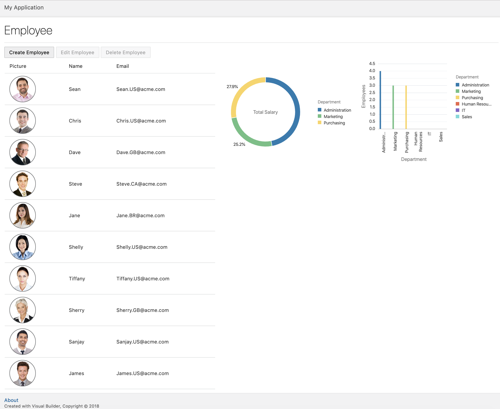

# Part 3: Adding a Graphs to your application

## Introduction
In this part we will be adding two graphs to your application that visualises the number of employees per department and total salaries by department.

### Steps
----
> 1. Adding Total Salary by Department

Please follow the video instructions.

> <a href="../resources/images/graph/CreateSalaryChart.mp4">Download Video</a>

> 2. Adding Total Employees by Department

Please follow the video instructions.

> <a href="../resources/images/graph/CreateEmployeeChart.mp4">Download Video</a>

> 3. Now you're ready to preview your application, click the `preview` button

## Well done!! You are done and have completed your First Application.

> [`HOME`](../README.md) | [`PART 1`](PART_1.md) | [`PART 2`](PART_2.md) | [`PART 3`](PART_3.md)
